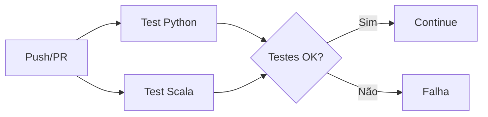

# CI/CD Pipeline - Brain Agriculture

## Visão Geral

Pipeline completo de CI/CD implementado para ambas as APIs (Python e Scala) com GitHub Actions, Docker e automação completa.

## 🚀 Arquitetura do Pipeline

### 1. **GitHub Actions Workflows**

#### **Workflow Principal: `ci-cd.yml`**
```yaml
Triggers: push (main/develop), pull_request (main)
Jobs:
├── test-python      # Testes da API Python
├── test-scala       # Testes da API Scala  
├── build-images     # Build das imagens Docker
├── integration-tests # Testes de integração
├── deploy           # Deploy (apenas main)
└── notifications    # Notificações de status
```

#### **Workflow de Testes: `tests-only.yml`**
```yaml
Triggers: push (branches exceto main), pull_request
Jobs:
└── quick-tests      # Testes rápidos (matriz Python/Scala)
```

### 2. **Docker Compose para CI**

#### **`docker-compose.ci.yml`**
- **python-api-ci**: Container para testes Python
- **scala-api-ci**: Container para testes Scala
- **postgres-ci**: Banco PostgreSQL isolado
- **test-runner**: Orquestrador dos testes

### 3. **Makefile Automatizado**

Comandos disponíveis:
```bash
make help           # Ver todos os comandos
make test           # Executar todos os testes
make run-ci         # Pipeline CI completo
make deploy-local   # Deploy local
make check-health   # Verificar APIs
```

## 🔄 Fluxo do Pipeline

### **Stage 1: Testes Unitários**


**Python Tests:**
- Validadores CPF/CNPJ
- Sistema de segurança
- Importações de módulos
- Testes isolados

**Scala Tests:**
- Compilação SBT
- TestRunner customizado
- ScalaTest suite
- Validadores e modelos

### **Stage 2: Build das Imagens**
```yaml
Condição: Apenas após testes passarem + branch main
Outputs:
- ghcr.io/repo/brain-agriculture-python:latest
- ghcr.io/repo/brain-agriculture-scala:latest
- Tags com SHA do commit
```

### **Stage 3: Testes de Integração**
- Deploy completo com Docker Compose
- Health checks das APIs
- Teste de conectividade
- Validação de endpoints

### **Stage 4: Deploy**
```yaml
Condição: main + push + testes OK
Environment: production
Action: Notificação de deploy pronto
```

## 🐳 Execução Local do CI

### **Comando Rápido:**
```bash
make run-ci
```

### **Comando Detalhado:**
```bash
# Build das imagens
make build-ci

# Executar pipeline completo
docker-compose -f docker-compose.ci.yml up --build --abort-on-container-exit

# Limpar ambiente
make clean-ci
```

### **Output Esperado:**
```
================================
EXECUTANDO PIPELINE DE TESTES CI
================================
🐍 Testando API Python...
OK test_cpf_valid passou
OK test_cnpj_valid passou
Todos os testes de segurança passaram!

⚡ Testando API Scala...
Compilando projeto Scala...
OK: Testes de validação passaram
OK: Modelos funcionando

🌍 Executando testes globais...
OK Testes Python: SUCESSO
OK Estrutura Scala: CONFIGURADA
================================
PIPELINE CI CONCLUÍDO COM SUCESSO
================================
```

## 🔍 Monitoramento e Health Checks

### **Health Checks Automatizados:**
```bash
make check-health
```

**Verifica:**
- Python API: `http://localhost:8000/docs`
- Scala API: `http://localhost:8080/health`
- Banco PostgreSQL: Conectividade
- Containers: Status de execução

### **Logs em Tempo Real:**
```bash
make logs-python    # Logs API Python
make logs-scala     # Logs API Scala
docker-compose logs -f  # Todos os logs
```

## 🎯 Configuração no GitHub

### **1. Secrets Necessários:**
```yaml
GITHUB_TOKEN: # Automático para packages
```

### **2. Permissions:**
```yaml
permissions:
  contents: read      # Ler código
  packages: write     # Publicar imagens
```

### **3. Environments:**
```yaml
production:
  protection_rules: true
  required_reviewers: []
```

## 📊 Matriz de Testes

### **Ambientes Testados:**
```yaml
OS: ubuntu-latest
Python: [3.11]
Java: [11] 
Scala: [2.13]
PostgreSQL: [13]
```

### **Browsers/Clients:**
- curl para health checks
- Docker containers isolados
- Volumes temporários
- Networks isoladas

## 🚦 Status e Badges

### **GitHub Actions Status:**
- ✅ **test-python**: Testes Python passando
- ✅ **test-scala**: Testes Scala passando  
- ✅ **build-images**: Imagens construídas
- ✅ **integration-tests**: Integração OK

### **Comandos de Status:**
```bash
make status         # Status containers
docker-compose ps   # Processos ativos
make check-health   # Health das APIs
```

## 🔧 Troubleshooting

### **Problema: Testes Scala falhando**
```bash
# Verificar SBT instalado
sbt version

# Limpar cache
cd api_scala && sbt clean

# Recompilar
cd api_scala && sbt compile
```

### **Problema: Testes Python falhando**
```bash
# Verificar dependências
cd api_python && pip install -r requirements.txt

# Testes isolados
cd api_python && python tests/test_validators_isolated.py
```

### **Problema: Docker build falhando**
```bash
# Limpar tudo
make clean-all

# Rebuild from scratch
make build-ci
```

### **Problema: PostgreSQL não conectando**
```bash
# Verificar porta
docker-compose ps

# Logs do banco
docker-compose logs postgres-ci

# Restart clean
make clean-ci && make run-ci
```

## 📈 Próximos Passos

### **Melhorias Planejadas:**
1. **Code Coverage**: Relatórios detalhados
2. **Security Scanning**: Snyk/OWASP
3. **Performance Tests**: JMeter/Gatling
4. **Multi-stage Deploy**: Dev/Staging/Prod
5. **Rollback Automático**: Deploy safety
6. **Slack/Discord**: Notificações
7. **Artifact Storage**: Releases
8. **Database Migrations**: Automação

### **Comandos para Deploy:**
```bash
# Staging
make deploy-staging

# Production  
make deploy-production

# Rollback
make rollback

# Health monitoring
make monitor
```

---

**Pipeline desenvolvido para Brain Agriculture Tech Challenge**  
**Arquiteturas: Python (FastAPI) + Scala (Akka HTTP)**  
**CI/CD: GitHub Actions + Docker + PostgreSQL**

## 📋 Checklist de Deploy

- [ ] Testes Python passando
- [ ] Testes Scala passando
- [ ] Imagens Docker construídas
- [ ] Health checks OK
- [ ] Base de dados configurada
- [ ] Variáveis de ambiente configuradas
- [ ] SSL/HTTPS configurado (produção)
- [ ] Monitoring ativo
- [ ] Backup configurado
- [ ] Rollback testado